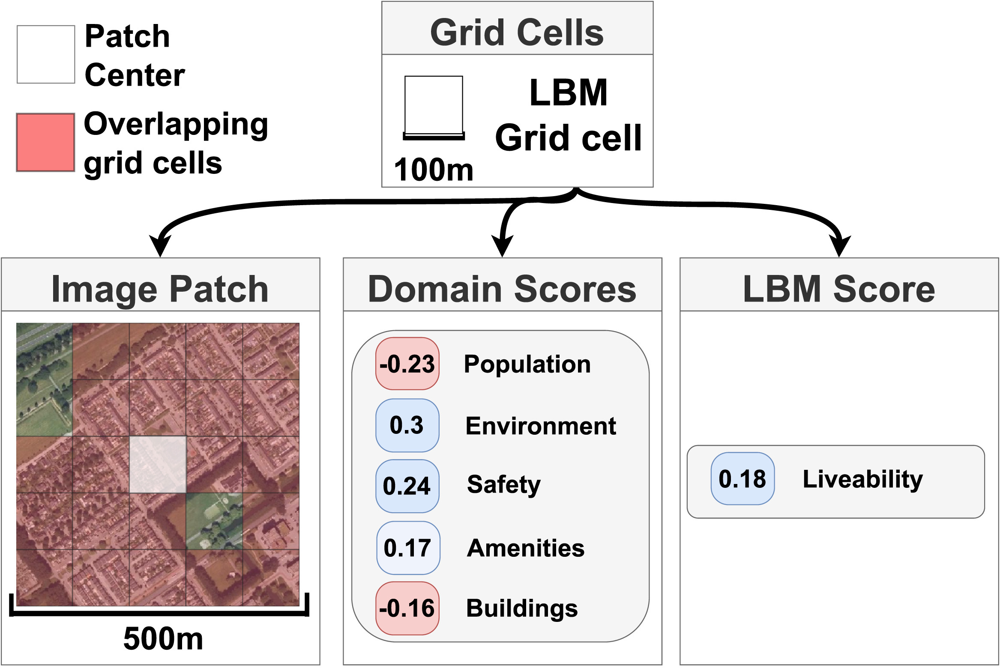

# liveability-rs

This work contains the code used to train models as in our paper "Predicting the Liveability of Dutch Cities With Aerial Images and Semantic Intermediate Concepts". This repository contains code which has been refactored slightly. A snapshot of the exact code to reproduce our models can be found in the following zip files:

RGB with bottleneck: <https://drive.google.com/file/d/1LgMcvGK1TnuEZSaXJOTs-pDtfT9nnOfU/view?usp=share_link> 
RGB baseline: <https://drive.google.com/file/d/1SBjOqOjq_j3LjbGOuPzdkO3FRmp7jyMR/view?usp=share_link>

The full paper is published as open-access here: <https://doi.org/10.1016/j.rse.2023.113454>

The dataset is available on the following Zenodo library: <https://zenodo.org/record/7574211>

Code and scripts for making your own dataset from the LBM labels and the Dutch publicly available aerial images will be released in the coming quarter for an upcoming publication. Stay tuned! 
